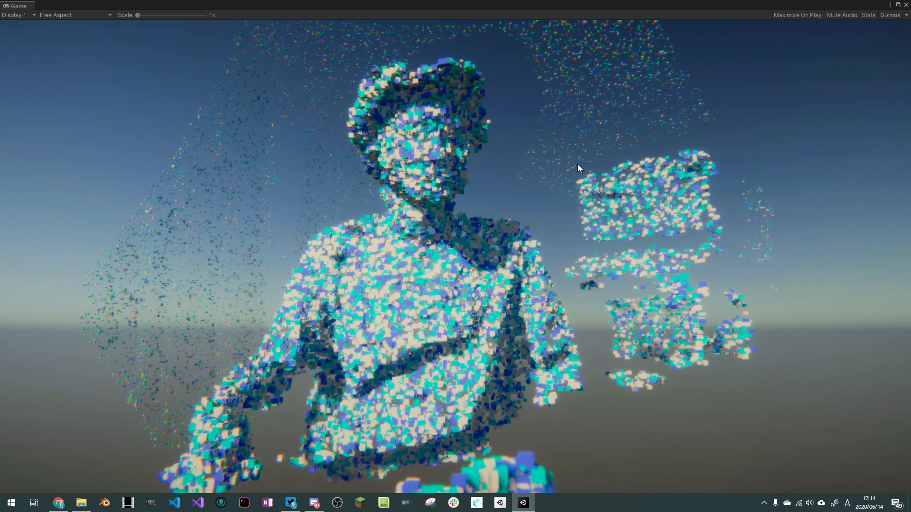

# K4A-PointCloud-VFX

## About

Azure Kinectの点群をVFX Graphで扱うデモです。
以下の記事を参考にしています。

- [【Unity】Face Tracking with ARKit + Visual Effect Graph(VFX Graph)で遊んでみる](https://qiita.com/mao_/items/0fffc84b2b16cf680f80)
- [C#で始めるAzure Kinect開発⑥：Unity+C#でPoint Cloud表示](https://tks-yoshinaga.hatenablog.com/entry/azurekinect-6)

## Tested Env

以下に示す環境での動作を確認しました。

|環境|概要|
|:---:|:---:|
|OS|Windows 10 Home|
|CPU|Core i7-7700|
|GPU|GeForce GTX 1060 3GB|
|Unity version|2019.3.15|
|HDRP version|7.3.1|
|VFX Graph version|7.3.1|
|Azure Kinect SDK version|1.4.0|

## Set up

[NuGet for Unityパッケージ](https://github.com/GlitchEnzo/NuGetForUnity/releases)をインポートし、Azure Kinect Sensor NuGetパッケージをインストールした後に、各種dll(`depthengine_2_0.dll`, `k4a.dll`)を`Assets/Plugins/`以下に配置します。
詳しくは上で紹介した[こちらの記事](https://tks-yoshinaga.hatenablog.com/entry/azurekinect-5)を参考にしてください。

## Contact

何かございましたら、こちらの[にー兄さんのTwitter](https:www.twitter.com/ninisan_drumath)までご連絡ください。
